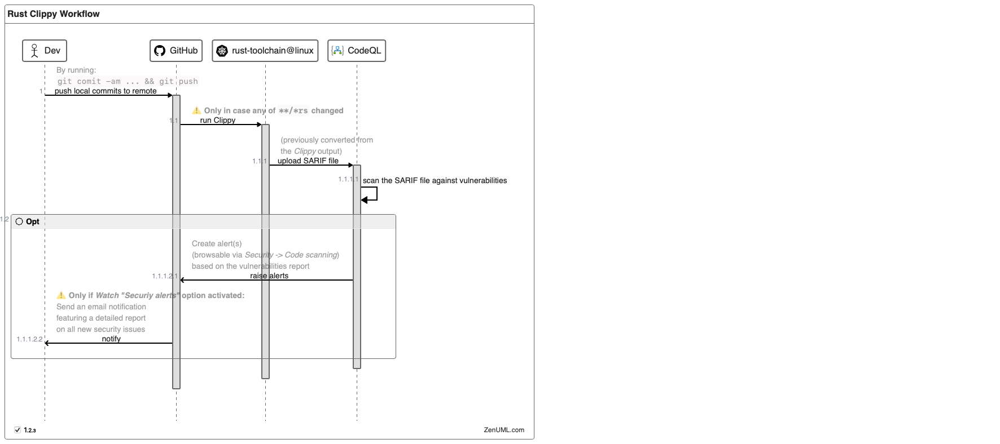

# workflows

This configuration directory containing various [**_reusable_**](https://docs.github.com/en/actions/how-tos/reuse-automations/reuse-workflows) 
(i.t. to be called by another workflow) YAML files describing GitHub Actions workflows, as advised [here](https://docs.github.com/en/actions/get-started/understanding-github-actions#workflows):

_A workflow is a configurable automated process that will run one or more jobs.
Workflows are defined by a YAML file checked in to your repository and will run when triggered by an event in your repository,
or they can be triggered manually, or at a defined schedule._

This repo features the following workflows:

| Name                     | YAML                                            |               [Triggering <br>event](https://docs.github.com/en/actions/reference/events-that-trigger-workflows)                | Description                                                                                                                          | Artifacts <br>(produced during runtime) |
|--------------------------|-------------------------------------------------|:-------------------------------------------------------------------------------------------------------------------------------:|--------------------------------------------------------------------------------------------------------------------------------------|:---------------------------------------:|
| rust-clippy analyze      | [`rust-clippy.yml`](rust-clippy.yml)            | [workflow_call](https://docs.github.com/en/actions/reference/workflows-and-actions/events-that-trigger-workflows#workflow_call) | Checks Rust package to catch common mistakes and improve the code                                                                    |                   :x:                   |
| OSV-Scanner              | [`osv-scanner.yml`](rust-osv-scanner.yml)       | [workflow_call](https://docs.github.com/en/actions/reference/workflows-and-actions/events-that-trigger-workflows#workflow_call) | Run OSV (vulnerabilities) scanner                                                                                                    |           :white_check_mark:            |
| Build and test Rust code | [`build-and-test.yml`](rust-build-and-test.yml) | [workflow_call](https://docs.github.com/en/actions/reference/workflows-and-actions/events-that-trigger-workflows#workflow_call) | Compile a local package and all of its dependencies and execute all unit and integration tests and build examples of a local package |                   :x:                   |

## Workflow sequences

### `rust-clippy.yml`



## (Re)usage examples

### `rust-clippy.yml`

```yaml
on:
  push:
    #branches: [ "main" ]
    # speed up the CI pipeline, since the linting process will not be performed if no source code files were changed.
    paths:
      - '**/*.rs'

permissions:
  # Required to upload SARIF file to CodeQL. See: https://github.com/github/codeql-action/issues/2117
  actions: read
  # Require writing security events to upload SARIF file to security tab
  security-events: write
  # to fetch code (actions/checkout)
  contents: read

jobs:
  rust-clippy:
    uses: swiyu-admin-ch/github-actions-workflows/.github/workflows/rust-clippy.yml@main
```
