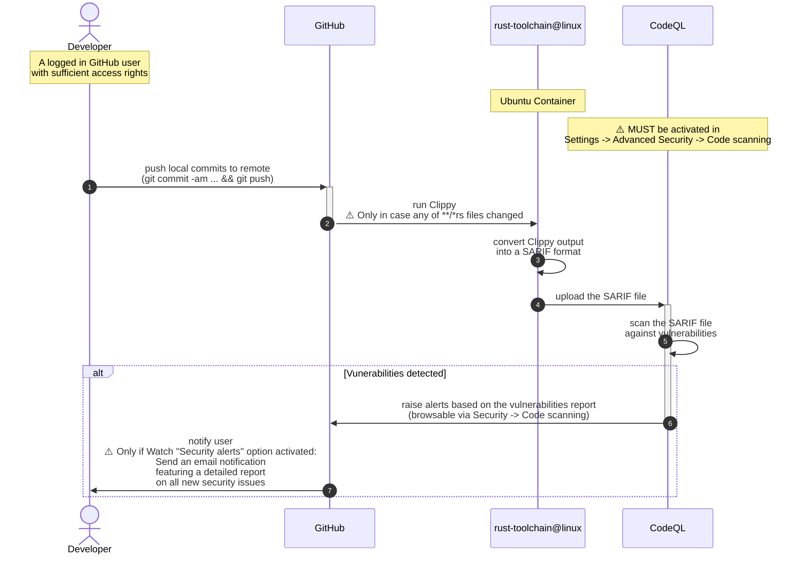
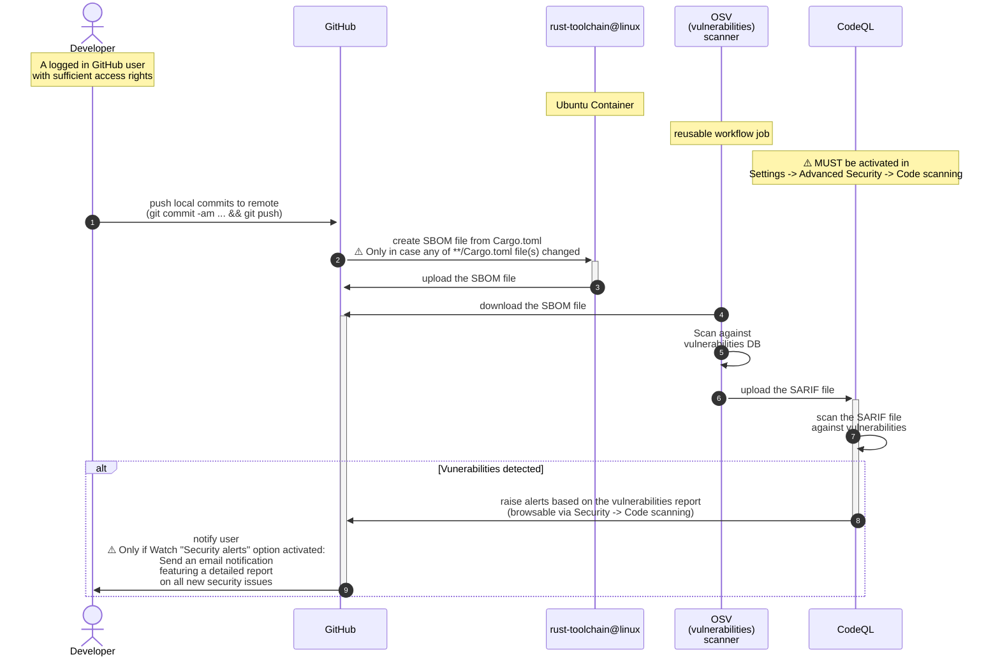
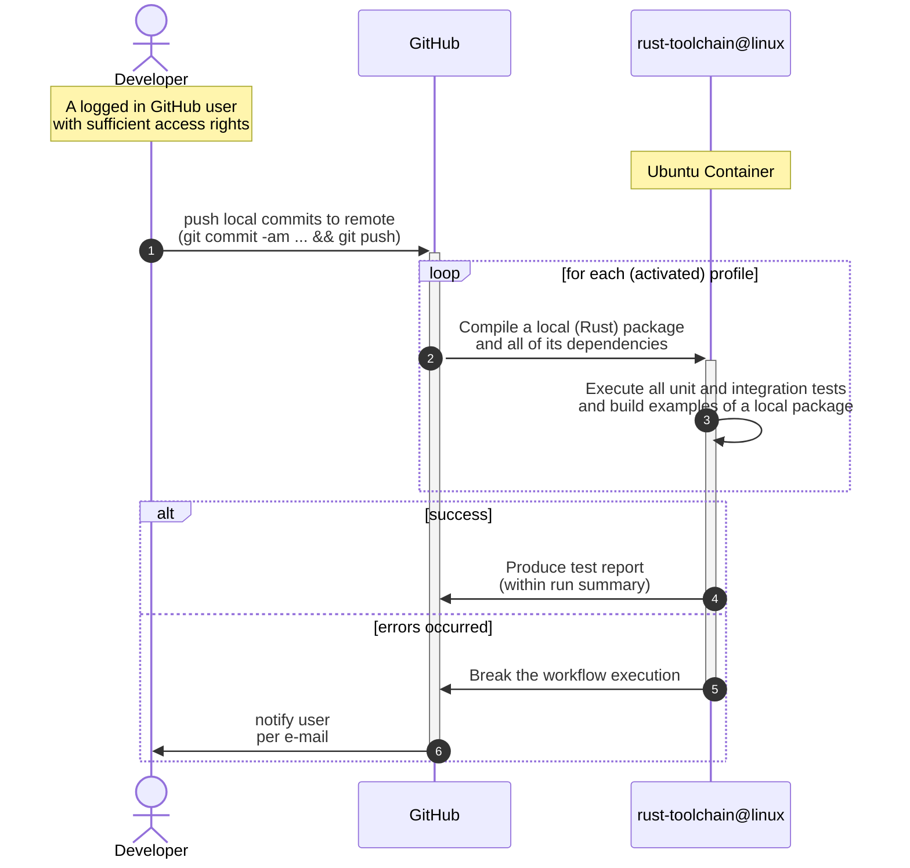
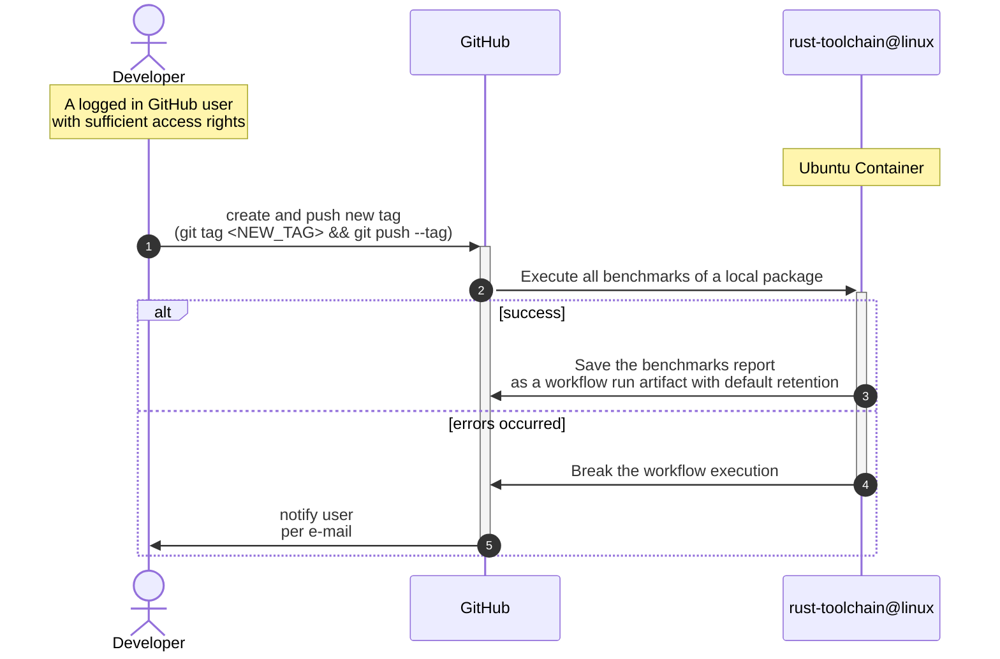

# github-actions-workflows

This repo features various [**reusable**](https://docs.github.com/en/actions/how-tos/reuse-automations/reuse-workflows)
(i.e. to be called by another workflow) GitHub Actions workflows intended to be used by other code (Rust/Java) repos
in this GitHub organization.

The following [workflow_call](https://docs.github.com/en/actions/reference/workflows-and-actions/events-that-trigger-workflows#workflow_call) workflows are available out-of-the-box:

| Name                     | YAML                                                                   | Required<br> [permissions](https://docs.github.com/en/actions/reference/workflows-and-actions/workflow-syntax#permissions) | Description                                                                                                                                                 |                 Inputs                 | Artifacts <br>(produced during runtime) |
|--------------------------|------------------------------------------------------------------------|:--------------------------------------------------------------------------------------------------------------------------:|-------------------------------------------------------------------------------------------------------------------------------------------------------------|:--------------------------------------:|:---------------------------------------:|
| rust-clippy analyze      | [`rust-clippy.yml`](.github/workflows/rust-clippy.yml)                 |                         `actions: read`<br><br> `security-events: write`<br><br> `contents: read`                          | Checks Rust package to catch common mistakes and improve the code                                                                                           |                  :x:                   |                   :x:                   |
| OSV-Scanner for Rust     | [`rust-osv-scanner.yml`](.github/workflows/rust-osv-scanner.yml)       |                         `actions: read`<br><br> `security-events: write`<br><br> `contents: read`                          | Run OSV (vulnerabilities) scanner                                                                                                                           |                  :x:                   |           :white_check_mark:            |
| Build and test Rust code | [`rust-build-and-test.yml`](.github/workflows/rust-build-and-test.yml) |                                          `contents: read`<br><br> `checks: write`                                          | Compile a local package and all of its dependencies and execute all unit and integration tests and build examples of a local package. Test report included. |       `debug`<br><br> `release`        |                   :x:                   |
| Execute Rust benchmarks  | [`rust-benchmarks.yml`](.github/workflows/rust-benchmarks.yml)         |                                                      `contents: read`                                                      | Execute all benchmarks of a local package                                                                                                                   | `quiet`<br><br> `report-filename-base` |           :white_check_mark:            |

## Workflows

If [reused in a typical fashion](#reusage-examples), the workflows are rather simple and pretty similar to each other.

Here depicted are some typical usage scenarios widely used across all (Rust/Java) code repos in this GitHub organization.

### A [`rust-clippy.yml`](.github/workflows/rust-clippy.yml) sequence



### A [`rust-osv-scanner.yml`](.github/workflows/rust-osv-scanner.yml) sequence



### Typical [`rust-build-and-test.yml`](.github/workflows/rust-build-and-test.yml) sequence



### Typical [`rust-benchmarks.yml`](.github/workflows/rust-benchmarks.yml) sequence



## (Re)usage examples

Here are just a few indicative usage examples as seen in other code (Rust/Java) repos in this GitHub organization.

### Reusing [`rust-clippy.yml`](.github/workflows/rust-clippy.yml)

```yaml
on:
  push:
    #branches: [ "main" ]
    # speed up the CI pipeline, since the linting process will not be performed if no source code files were changed.
    paths:
      - '**/*.rs'

permissions:
  # Required to upload SARIF file to CodeQL. See: https://github.com/github/codeql-action/issues/2117
  actions: read
  # Require writing security events to upload SARIF file to security tab
  security-events: write
  # to fetch code (actions/checkout)
  contents: read

jobs:
  rust-clippy:
    uses: swiyu-admin-ch/github-actions-workflows/.github/workflows/rust-clippy.yml@main
```

### Reusing [`rust-osv-scanner.yml`](.github/workflows/rust-osv-scanner.yml)

```yaml
on:
  push:
    #branches: [ "main" ]
    # speed up the CI pipeline, since the audit process will not be performed if no dependencies were changed.
    paths:
      - '**/Cargo.toml'

permissions:
  # Required to upload SARIF file to CodeQL. See: https://github.com/github/codeql-action/issues/2117
  actions: read
  # Require writing security events to upload SARIF file to security tab
  security-events: write
  # to fetch code (actions/checkout)
  contents: read

jobs:
  rust-osv-scanner:
    uses: swiyu-admin-ch/github-actions-workflows/.github/workflows/rust-osv-scanner.yml@main
```

### Reusing [`rust-build-and-test.yml`](.github/workflows/rust-build-and-test.yml)

```yaml
on:
  # On each an every push across all branches
  push:
  #branches: [ "main" ]

permissions:
  # to fetch code (actions/checkout)
  contents: read
  # as explained by:
  # - https://github.com/marketplace/actions/publish-test-results#permissions
  # - https://github.com/marketplace/actions/junit-report-action
  checks: write
  pull-requests: write # only required if `comment: true` was enabled

jobs:
  rust-build-and-test:
    uses: swiyu-admin-ch/github-actions-workflows/.github/workflows/rust-build-and-test.yml@main
```

### Reusing [`rust-benchmarks.yml`](.github/workflows/rust-benchmarks.yml)

```yaml
on:
  # Intended to be triggered manually
  workflow_dispatch:
  # Or perhaps latest if a new tag is pushed  
  push:
    tags:
      - '*'

permissions:
  # to fetch code (actions/checkout)
  contents: read

jobs:
  rust-benchmarks:
    uses: swiyu-admin-ch/github-actions-workflows/.github/workflows/rust-benchmarks.yml@main
      #with:
      # Whether to print cargo log messages (while running 'cargo bench ...' command)
      #quiet: true
      # The prefix to use for report bundle
    #report-filename-base: benchmarks-report
```
