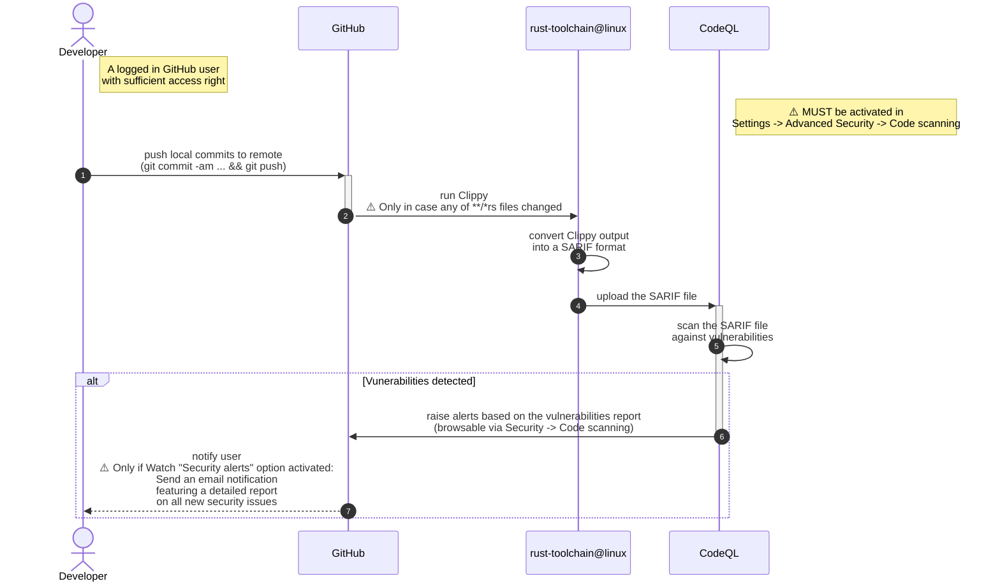
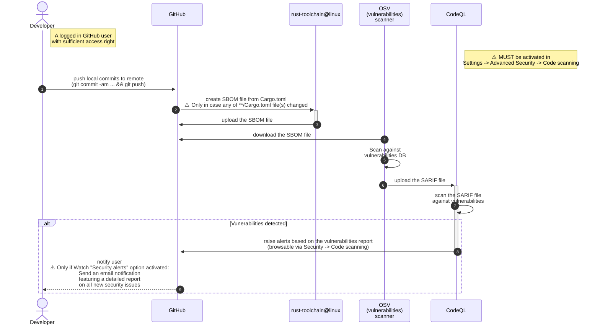

# github-actions-workflows

This repo features various [**reusable**](https://docs.github.com/en/actions/how-tos/reuse-automations/reuse-workflows)
(i.t. to be called by another workflow) GitHub Actions workflows intended to be used by other code (Rust/Java) repos 
in this GitHub organization.

The following [workflow_call](https://docs.github.com/en/actions/reference/workflows-and-actions/events-that-trigger-workflows#workflow_call) workflows are available out-of-the-box:

| Name                     | YAML                                                              | Required<br> [permissions](https://docs.github.com/en/actions/reference/workflows-and-actions/workflow-syntax#permissions) | Description                                                                                                                          | Artifacts <br>(produced during runtime) |
|--------------------------|-------------------------------------------------------------------|:---------------------------------------------------------------------------------------------------------------------------|--------------------------------------------------------------------------------------------------------------------------------------|:---------------------------------------:|
| rust-clippy analyze      | [`rust-clippy.yml`](.github/workflows/rust-clippy.yml)            | `actions: read`, <br>`security-events: write`, <br>`contents: read`                                                        | Checks Rust package to catch common mistakes and improve the code                                                                    |                   :x:                   |
| OSV-Scanner              | [`osv-scanner.yml`](.github/workflows/rust-osv-scanner.yml)       | `actions: read`, <br>`security-events: write`, <br>`contents: read`                                                        | Run OSV (vulnerabilities) scanner                                                                                                    |           :white_check_mark:            |
| Build and test Rust code | [`build-and-test.yml`](.github/workflows/rust-build-and-test.yml) | `contents: read`                                                                                                           | Compile a local package and all of its dependencies and execute all unit and integration tests and build examples of a local package |                   :x:                   |

## Workflows

### `rust-clippy.yml`



### `osv-scanner.yml`




## (Re)usage examples

### `rust-clippy.yml`

```yaml
on:
  push:
    #branches: [ "main" ]
    # speed up the CI pipeline, since the linting process will not be performed if no source code files were changed.
    paths:
      - '**/*.rs'

permissions:
  # Required to upload SARIF file to CodeQL. See: https://github.com/github/codeql-action/issues/2117
  actions: read
  # Require writing security events to upload SARIF file to security tab
  security-events: write
  # to fetch code (actions/checkout)
  contents: read

jobs:
  rust-clippy:
    uses: swiyu-admin-ch/github-actions-workflows/.github/workflows/rust-clippy.yml@main
```

### `osv-scanner.yml`

```yaml
on:
  push:
    #branches: [ "main" ]
    # speed up the CI pipeline, since the audit process will not be performed if no dependencies were changed.
    paths:
      - '**/Cargo.toml'

permissions:
  # Required to upload SARIF file to CodeQL. See: https://github.com/github/codeql-action/issues/2117
  actions: read
  # Require writing security events to upload SARIF file to security tab
  security-events: write
  # to fetch code (actions/checkout)
  contents: read

jobs:
  rust-osv-scanner:
    uses: swiyu-admin-ch/github-actions-workflows/.github/workflows/rust-osv-scanner.yml@main
```
